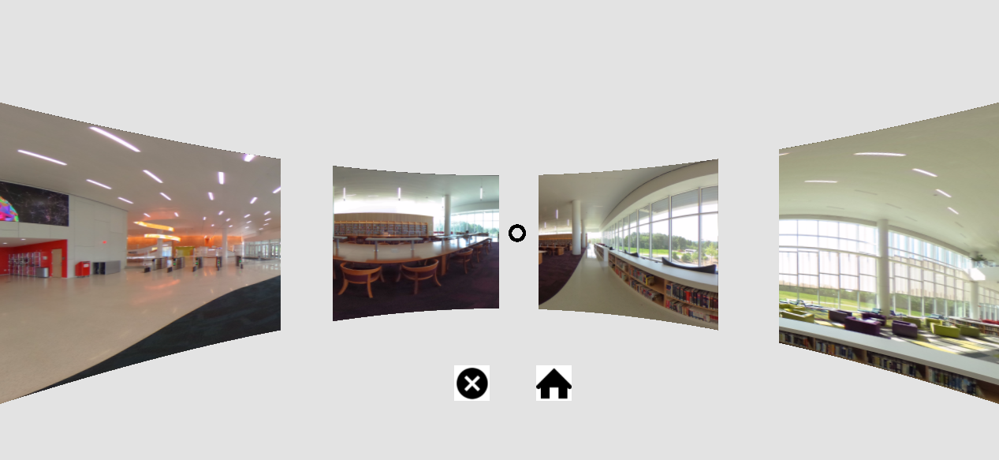
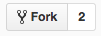
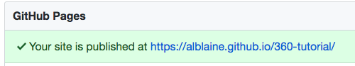
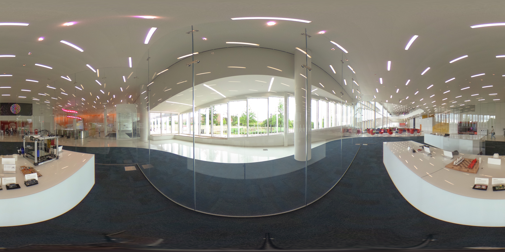

## 360˚ WebVR Virtual Tour Workshop
This app and tutorial were created by Shalini Sejwani ([@smsejwan](https://github.com/smsejwan)). The tutorial was adapted for a workshop at NCSU Libraries by Alison Blaine ([@alblaine](https://github.com/alblaine)).

### Introduction
The goal of this workshop is to create a virtual gallery of 360-degree photos that can be viewed in a VR headset. Here's an example of what the virtual gallery might look like:

</img>

Required preparation:
* Create a Github account at [https://github.com](https://github.com)

The webpage you’re looking at is called a “GitHub repository,” and it contains the files you'll use to build the virtual tour. Look at the folder structure and mentally note the names of the the folders.

Once you have looked at them, let's get started!

### Tutorial Videos on YouTube
This [set of tutorial videos at go.ncsu.edu/360playlist ](https://go.ncsu.edu/360playlist) accompanies this tutorial and is designed to help you see the steps in action. There is a video for each workshop task. It's best to open the video link in a new browser so that you can look at the videos and also edit the code.

### Create a Github account
If you do not already have a Github account, create one [here](https://github.com)

Log into your account.

### Fork the code repository ([helper video](https://youtu.be/yZmi2VQp4Mw?t=12))
A fork is like a copy of someone else's code repository that you can make changes to without affecting the original repository.

Click the "Fork" button in the top right of this page:


Select your repository as the place to fork it.

You should now have this code repository in your own Github account at the following address (replace YOUR_USERNAME with your Github account name):

https://github.com/Your_Username/360-tutorial

### Create a Github page for your project ([helper video](https://youtu.be/yZmi2VQp4Mw?t=35))
Click on Settings

Under Github Pages, click the dropdown menu under Source. Change to **master branch**


This will create a new web page where you can see your gallery live!

Refresh the settings page.

A green link should appear that looks like this:


Open your Github Pages link in a **new tab** to see your current 360 VR gallery.
https://pages.github.com/Your_Username/360-tutorial

### Learn to make your own gallery
This demo gallery only has 2 images. This workshop is going to guide you through adding **one new image** to the two that are already in the gallery. After the workshop, you can add more images on your own!

</img>

### Task 1: Upload image to the assets folder ([helper video](https://youtu.be/Sr0En2GScTg))

The first task is to upload the images you just clicked in the asset folder.

If you don't have images you can use these images from a Google Drive folder. Download these [360 images](https://drive.google.com/open?id=0B7icOoMjnbmPZDBjVFAycHN4a3c) to your Desktop to use them.

Open the [*assets*](https://github.com/Your_Username/360-tutorial/tree/master/assets) folder in your repository.  


We already have two images in the gallery, and we will keep those. Rename your image you want to add to the following: **3.jpg**.

Then click on ‘Upload files’ button.


**Upload the new image to the assets folder** (3.jpg).

After you are done uploading the image to the ‘assets’ folder, go to the [gallery.html](https://github.com/Your_Username/360-tutorial/blob/master/gallery.html) in your repository.

Click on the edit button.


In the next task, you will add some code in here to be able to see your new image.


### Task 2: Edit gallery.html file to add your image as an asset. ([helper video](https://youtu.be/CmrXa2nGlzo))
Place all your assets in one place for better performance.

Click on the 360-tutorial link at the top left of the page to go back to the list of files.

Click on gallery.html

Look at lines 16 to 24 in the gallery.html file for reference


Place asset files (i.e., the photos) between these bracketed phrases ```<a-assets> </a-assets>```

The code for adding an asset looks like this:
```html


```

You need to add an asset in the code for your image that you just uploaded.

Go to gallery.html and start adding assets on line 19 in gallery.html file.

Note that each img id must be different. Use this pattern: For 1st image: id="first" and for the second image: id="second" etc.) For your image, you can type id="third".

The src needs to show the location (in the assets folder) and name of the file: "assets/imagename.jpg" (Example: src=”assets/1.jpg”)

*Hint: You can look at the assets already added for other images at lines 17 and 18.*

When you've done this for your image, scroll to the bottom of the page and press the green commit button.

### Task 3: Add the curved-image component for the new image. ([helper video](https://youtu.be/1SlEnwxlCOI))
You have now linked your image to our webpage. Your next task is to display them.
To display them, we need to add a line like:

```html
<a-curvedimage
id="one"
src="#first"
height="3"
radius="5"
theta-length="40"
rotation="0 280 0"
position="0 0.8 0">
</a-curvedimage>
```

**Id:** identifies this element uniquely.  
**Height:** is the height of image.  
**Radius:** is the radius by which you want your image to appear curved.  
**Theta-length:** is the length occupied by the image in a circle. Circumference of the circle is 360 and here we have 6 images, and we are giving a theta length of 40 to each and there is a distance of 10 degrees between each image to keep them separated.  
**Position:** We are placing our 1st image at the position “0 280 0” moving along the y axis, we reduce the degree 50 (40 degree is space occupied by each image + 10 degree for distance between each image) so the position of our *second image will be “0 230 0”* and similarly for *third image it will be “0 180 0”* and so on.  

Here the properties **“id”**, **“src”** and **“rotation”**  need to be changed for each new image.

Refer to line 30 to 39 in gallery.html and add similar lines there.  


Remember Since you have linked the locations of these images using `<assets>`, the id specified in the assets and src in the component need to be same

Example: If your asset is:
```html
 
 ```
 Then your corresponding curved-image should be:
 ```html
 <a-curvedimage id="two" src="#second" transparent="true" height="3"
 radius="5" theta-length="40" rotation="0 280 0" position="0 0.8 0">
 </a-curvedimage>
 ```

 See that id in assets is same as src in your curved-image component.
 Start adding code at line 38.

 Once you’ve changed the code in **gallery.html**, click on this link to make sure the image appears: https://pages.github.ncsu.edu/YOUR_USERNAME/360-tutorial/gallery.html

 If the image does not appear, we can help you troubleshoot.

### Task 4: Add the 360 image file to a Demo folder. ([helper video](https://youtu.be/WbdNPDK2rak))

Go to https://github.com/Your_Username/360-tutorial/tree/master/demos

There needs to be a folder for each 360 image. Each folder has its own .html file, javascript, and assets folder.

As you can see, there are already 6 folders created in this view, to make it easier to add a total of 6 images in the gallery.

Since you are adding a third image to the gallery, you will need to go into folder 3 and make two changes:
The first change is in /demos/3/assets/. Click on the assets folder inside of folder 3.

Add your image (3.jpg) by uploading it to the assets folder. Click "Upload files" button and select 3.jpg from your computer. Commit this change.

The second change: Now go into Folder 3 and open the index.html file.

At line 13:
```

```
Change *1-bg* to the name of image you just added to the assets folder. (Ex: 3.jpg)

And at line 31:
```
 <a-sky src="#background" rotation="0 -130 0"></a-sky>
 ```
Make sure your id in line 13 is similar to your src on your line 31, in this case, id="background" and src="assets"

Explanation of line 31:
The component ``` <a-sky> ``` adds a background color or 360° image to a scene. A sky is a large sphere with a color or texture mapped to the inside.

### Task 5: Add Link to the demos in gallery.html ([helper video](https://youtu.be/WbdNPDK2rak?list=PLFtxGQKkdHa03RFEyUhgHShPm9llCDncL&t=87))
Now you need to connect the image in the gallery to its 360 view. To do so you will use javascript.
You can refer the code below, which shows an example of how the first image is linked to its 360 view
```
document.querySelector("#one").addEventListener('click', function() {
                window.location.href = "demos/1/index.html";
            });
```

Now to finish the Task 5 you need to add similar code for the images that you just added.

REMEMBER: That the id used in the curved-image component should be similar to the querySelector in your javascript.

Example: If your curved image component is ```html <a-curvedimage id="three" src="#third" transparent="true" height="3" radius="5" theta-length="40" rotation="0 180 0" position="0 0.8 0"> </a-curvedimage>```

 Then your javascript will be ```document.querySelector("#three").addEventListener('click', function() {window.location.href = "demos/3/index.html";});```

 Start editing gallery.html from line 105. This is what the code you add should look like:

 ```
 document.querySelector("#three").addEventListener('click', function() {
                 window.location.href = "demos/3/index.html";
             });
 ```

 Commit your changes.

### Task 5B - Testing ([helper video](https://youtu.be/IDxwfLmBxzU))
 Now you can test your app here and check if all the links are working in your repository.

### Add more images
Now that you have had practice adding one image, you can add more images to your gallery using the same process.

### Additional Work: Going Deeper with A-Frame
You have now worked with the major components of A-Frame to create your own gallery, and you can stop here. To better understand the code, let's take a look at some remaining concepts:

In our gallery.html file:

The first part is the ***header section*** of our HTML file.

Here we are just linking our aframe.js


Next comes setting up ***A-scene***  

A scene is represented by the `<a-scene>` element. The scene contains all entities.  
The functions of `<a-scene>` are to:
- Add default canvas, renderer camera and lights
- Set up VREffect
- Add UI to Enter VR that calls WebVR API


The first section in a-scene is to add assets.  
We place all our assets in one place to preload and cache assets for better performance, as we did in our app to add all images in the assets section.  

Next we add all the things that we want to appear on our screen.
In our case we add all the image components:


Next is adding sky and light components and setting up the camera and cursor.  
**Sky:**  Sky component adds a background color or 360° image to a scene.  
**Camera:** Camera determines what the user sees. We can change the view of user by modifying the camera’s position and rotation.  
**Cursor:** Cursor provides basic interactivity with a scene on devices that do not have a hand controller. The default appearance is a ring geometry. The cursor is usually placed as a child of the camera.  


Then we finally add our javascript to load VR mode automatically and link images


### A-Frame Documentation
You can extend your app and make other webVR projects. To find out more, see the A-Frame documentation: https://aframe.io/docs/0.5.0/introduction/
